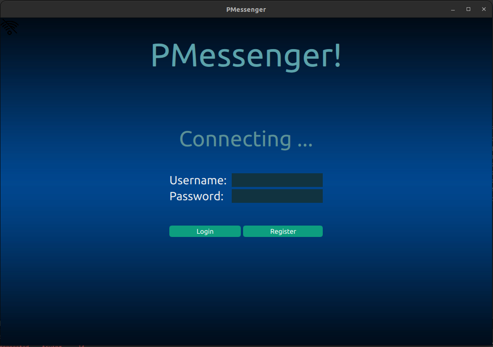
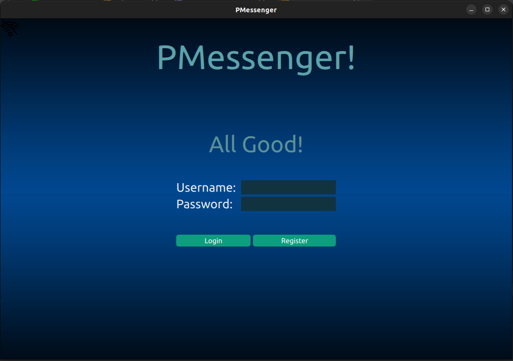
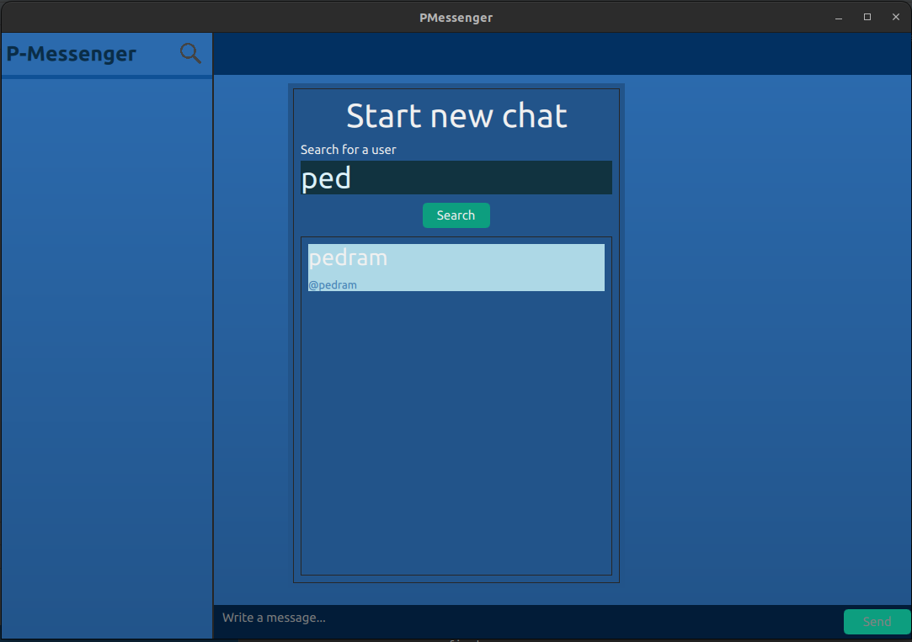
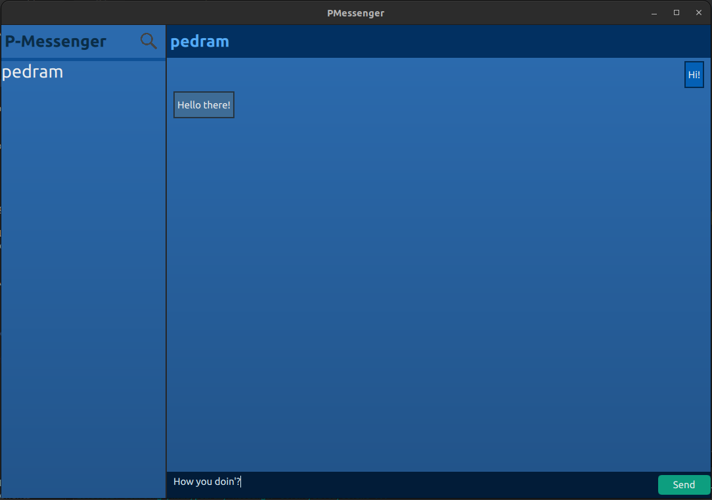

# PMessenger UI Client!
## A Client-Server cloud-based messenger application based on Telegram!
#### For now includes these features:
-   App can work as much as possible in offline and constantly tries to connect to server 
  |  
-   Register or login with a username and password
-   Search for other users and start a chat with them 

-   You can send messages even when you're offline. whenver you get online the pending messages will be sent.   

